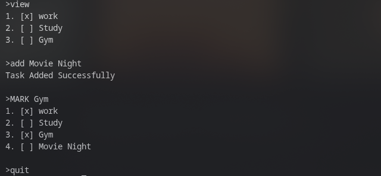

# CLI To-Do App in C++

A lightweight command-line to-do application built in C++. Supports adding, viewing, deleting, and marking tasks — with file persistence so your list survives between sessions.

---

## Compile & Run

```bash
g++ -o todo todo.cpp
./todo
```

---

## Commands

| Command | Description |
|---|---|
| `add <task name>` | Add a new task |
| `view` | View all tasks |
| `delete <task name>` | Delete a task by name |
| `mark <task name>` | Toggle a task as complete/incomplete |
| `menu` | Show the command list |
| `quit` | Save and quit |

Commands are case-insensitive — `ADD`, `Add`, and `add` all work.

---

## Features

- Tasks are saved to `tasks.txt` automatically after every change
- Tasks reload from file on startup — no data loss
- Checkbox-style display: `[ ]` pending, `[x]` done
- Duplicate-safe ID reindexing after deletion

---


## Screenshots




---